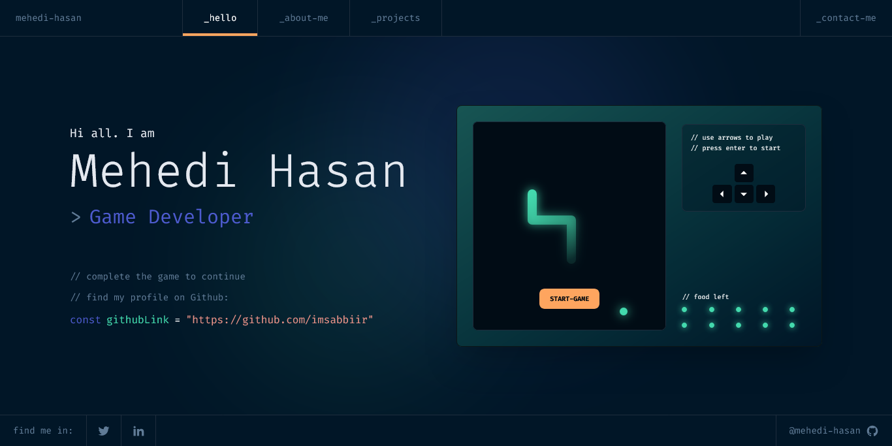
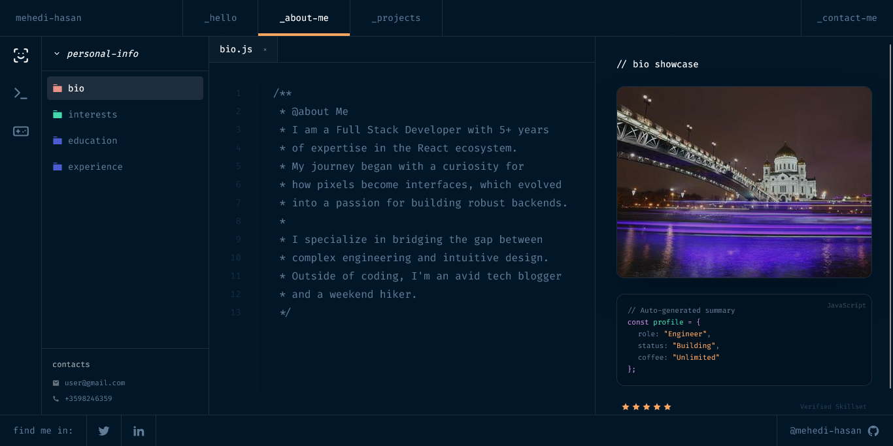
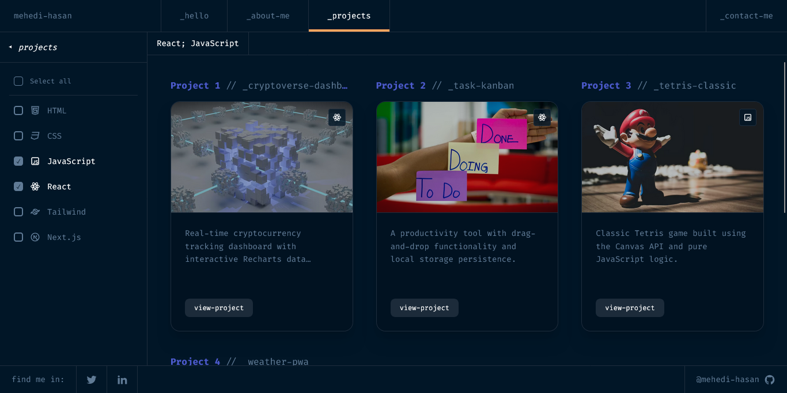
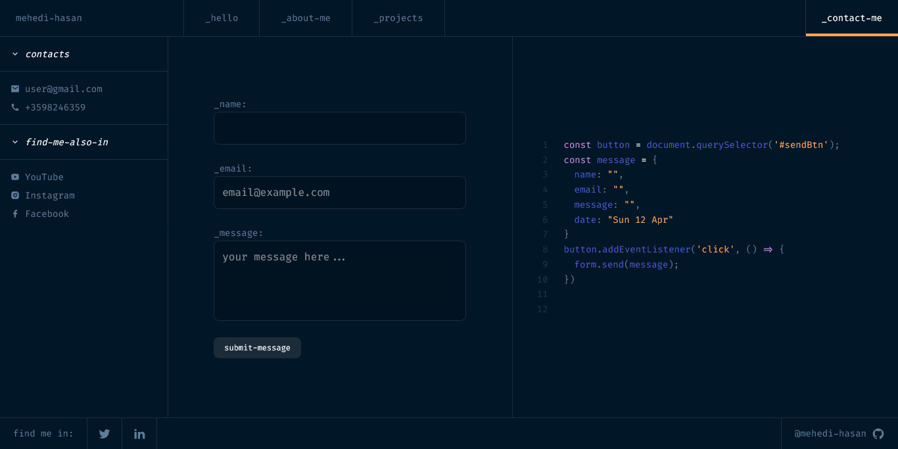
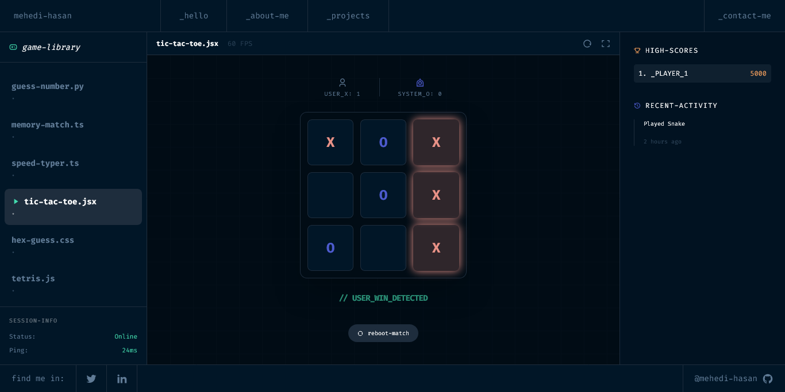
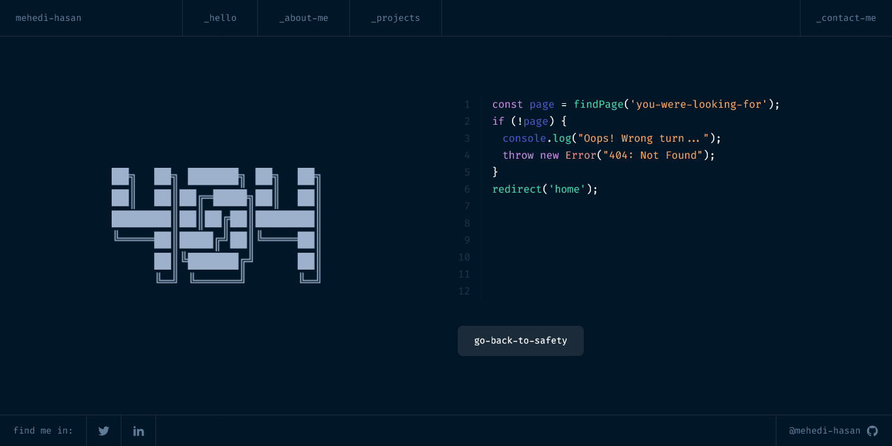

# 🎮 Game Developer Portfolio + Game Hub

A modern, fully responsive developer portfolio combined with interactive mini-games. Built to showcase projects, UI components, and game development skills in a unique terminal-inspired interface.

---

## 🚀 Live Preview
👉 [View Live Project](https://gamedeveloper-seven.vercel.app/)  

---

## ✨ Features

- 🧑‍💻 Developer Portfolio (Home, About, Projects, Contact)
- 🎮 Playing on site games.
- 🎮 Interactive Game Section
- 📄 Project Details Page
- 🧩 UI Components Showcase
- ❌ Custom Error Page (404)
- 📱 Fully Responsive (Mobile, Desktop)

---

## 🛠️ Tech Stack

- **Frontend:** React / Next.js, typescript
- **Styling:** Tailwind CSS
- **Icons:** React Icons and lucide icons
- **State Management:** React Hooks
- **Deployment:** Vercel .

---

## 📂 Project Structure
```

src/
├── app/                    # Next.js App Router (File-based routing)
│   ├── about/              # About page
│   ├── contact/            # Contact section
│   ├── games/              # Game listing page
│   ├── project/[id]/       # Dynamic routes for project details
│   ├── ui-components/      # App-specific UI logic
│   ├── layout.tsx          # Main application wrapper
│   ├── page.tsx            # Home page
│   └── not-found.tsx       # Erro page
├── components/             # Reusable Game & UI Components
│   ├── Header              # Site navigation
│   ├── Footer              # Site navigation
│   ├── HexGuess            # Site navigation
│   ├── MemoryMatch         # Site navigation
│   ├── NumberGuess         # Site navigation
│   ├── RockPaperScissors   # Site navigation
│   ├── Snake               # Site navigation
│   ├── SpeedTyper          # Site navigation
│   ├── Tetris              # Site navigation
│   └── TicTacToe           # Individual game logic & UI

```
---

## 🎮 Games Included

- 🐍 Snake Game  
- ✊ Rock Paper Scissors  
- 🔢 Guess The Number  
- 🧠 Memory Match  
- ⚡ Speed Typer  
- ❌⭕ Tic Tac Toe  
- 🔷 Hex Guess  
- 🧩 Tetris  

---
## 📸 Screenshots


### 🏠 Home Page




### 👤 About Page




### 📁 Projects Page




### 📬 Contact Page




### 🎮 Game Page




### ❌ Error Page



---

## ⚙️ Installation & Setup

Clone the repository:

```bash
git clone https://github.com/imsabbiir/gamedeveloper.git
